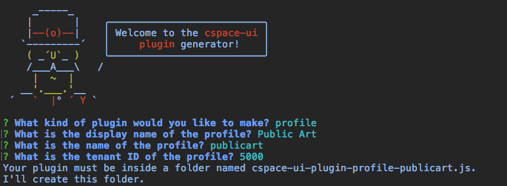

# Creating a Profile

UI configuration for a profile is implemented as a cspace-ui [plugin](../Plugins.md). At its simplest, a profile is just a JavaScript module that exports a function conforming to the [plugin API](../Plugins.md#plugin-api). That function supplies configuration overrides to apply to the UI.

Profiles are published as npm packages, for ease of discovery and installation. By convention, the npm package name for profile plugins should have the format `cspace-ui-plugin-profile-{profile name}`.

For convenience, a [Yeoman](http://yeoman.io/) [generator](https://www.npmjs.com/package/generator-cspace-ui-plugin) is available to create the scaffolding for cspace-ui plugins. A plugin project created with the generator will be structured similarly to the cspace-ui project itself, and will be configured to use the same build tools.

To create a profile using the generator:

## Prerequisites

On a server:

- Install CollectionSpace 5.0.
- Configure and enable a tenant on the CollectionSpace server to be used to demonstrate the profile. If the profile contains schema changes (e.g. new record types, adding extension fields to existing record types, changing the fields returned in list results for record types), these must be configured on the server, for the tenant. This is done by editing application layer XML files and deploying the services layer, as described in the [configuration documentation](https://wiki.collectionspace.org/display/UNRELEASED/Configuring+CollectionSpace).

On a development workstation (could be the same or a different machine as the server):

- Install [Node.js](https://nodejs.org/) 8+ and npm 5+.
- Install Yeoman and the CSpace UI plugin generator from npm.
```
npm install -g yo
npm install -g generator-cspace-ui-plugin
```

## Creating a New Profile Project

On the development workstation:

- Change to the directory in which the project should be created. The generator will create a directory in the current directory.

- Run the generator. This will ask a series of questions.
  ```
  yo cspace-ui-plugin
  ```
  

  - **What kind of plugin would you like to make?**
  Currently only profile plugins are supported. Press enter.

  - **What is the display name of the profile?**
  Enter a display name for the profile. This should be title case, and may include spaces. Do not include the word "profile". Examples: `Bonsai`, `Public Art`, `Fine and Contemporary Art`, `Local History and Material Culture`.

  - **What is the name of the profile?**
  Enter the profile name, as configured in the application layer. This is typically a short lowercase string, with no spaces. Examples: `bonsai`, `publicart`,  `fcart`, `lhmc`.

  - **What is the library name of the profile?**
  Enter the name to be used in the profile's JavaScript library. This should be identical to the profile name from the previous question, except for case. The library name should be camel cased, with an initial uppercase letter (also known as Pascal Case). Abbreviations should be capitalized. Examples: `Bonsai`, `PublicArt`, `FCArt`, `LHMC`.

  - **What is the tenant ID of the profile?**
  Enter the tenant ID of the profile, as configured in the application layer. This is typically a number.

- When installation is complete, change to the newly created directory, and start the dev server.
  ```
  cd cspace-ui-plugin-profile-{tenant name}.js
  npm run devserver
  ```
- In a browser, open the URL http://localhost:8080. The CollectionSpace UI should appear. In the lower right side of the footer, the name of the plugin should appear, followed by "version 0.0.1".

- By default, the UI in the devserver will attempt to connect to a CollectionSpace server at http://localhost:8180. To change this, edit index.html, and change the `serverUrl` setting. Reload the page in the browser for this change to take effect.

- Place profile configuration in src/index.js. For readability, configuration may be broken out into additional files that are imported into src/index.js. See other profiles for examples. As configuration is edited, the changes will be deployed into the browser automatically. Reloading is not necessary.
